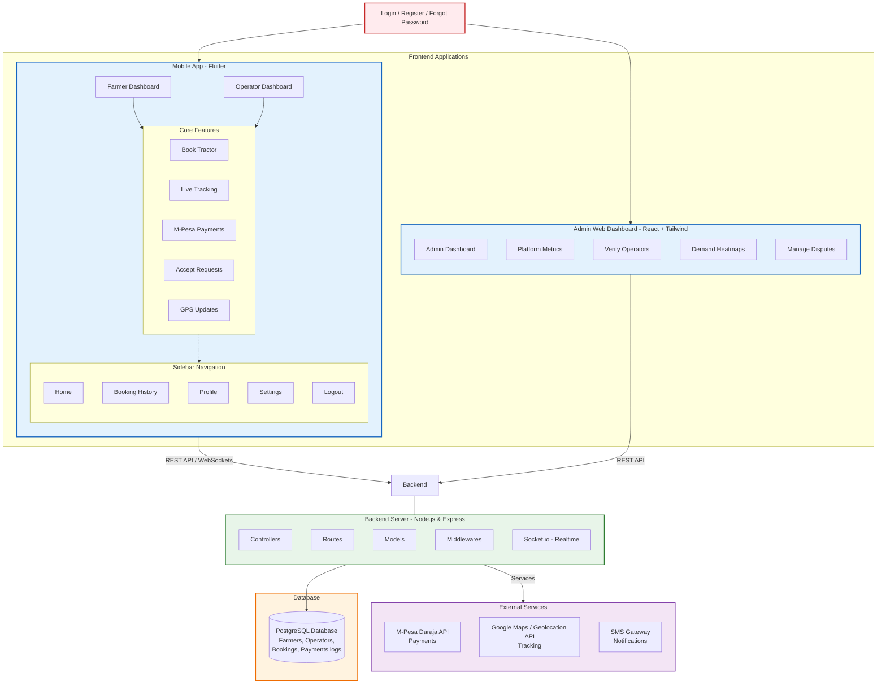

# Conceptual Framework

```mermaid
flowchart TD
    %% Base Level: Authentication
    Auth[Login / Register / Forgot Password]

    %% Level 2: Frontend Client Applications
    subgraph Frontend [Frontend Applications]
        direction LR
        
        subgraph MobileApp [Mobile App - Flutter]
            direction TB
            HomeFarmer[Farmer Dashboard]
            HomeOp[Operator Dashboard]
            
            subgraph Features [Core Features]
                direction LR
                FB[Book Tractor]
                FT[Live Tracking]
                FP[M-Pesa Payments]
                OA[Accept Requests]
                OU[GPS Updates]
            end
            
            subgraph Sidebar [Sidebar Navigation]
                direction TB
                NavHome[Home]
                NavHistory[Booking History]
                NavProfile[Profile]
                NavSettings[Settings]
                NavLogout[Logout]
            end
            
            HomeFarmer & HomeOp --> Features
            Features -.-> Sidebar
        end

        subgraph WebDashboard [Admin Web Dashboard - React + Tailwind]
            direction TB
            AdminHome[Admin Dashboard]
            Metrics[Platform Metrics]
            Verify[Verify Operators]
            Heatmap[Demand Heatmaps]
            Disputes[Manage Disputes]
        end
    end

    Auth --> MobileApp
    Auth --> WebDashboard

    %% Level 3: APIs connection
    MobileApp -- "REST API / WebSockets" --> Backend
    WebDashboard -- "REST API" --> Backend

    %% Level 4: Backend
    subgraph BackendSys [Backend Server - Node.js & Express]
        direction TB
        Controllers[Controllers]
        Routes[Routes]
        Models[Models]
        Middlewares[Middlewares]
        Sockets[Socket.io - Realtime]
    end
    
    Backend --- BackendSys

    %% External Services
    subgraph ExternalAPI [External Services]
        direction TB
        Mpesa[M-Pesa Daraja API\nPayments]
        Maps[Google Maps / Geolocation API\nTracking]
        SMS[SMS Gateway\nNotifications]
    end

    BackendSys -- "Services" --> ExternalAPI

    %% Level 5: Database
    subgraph DB [Database]
        PostgreSQL[(PostgreSQL Database\nFarmers, Operators,\nBookings, Payments logs)]
    end

    BackendSys --> PostgreSQL

    %% Styling
    classDef frontend fill:#e3f2fd,stroke:#1565c0,stroke-width:2px;
    classDef backend fill:#e8f5e9,stroke:#2e7d32,stroke-width:2px;
    classDef db fill:#fff3e0,stroke:#ef6c00,stroke-width:2px;
    classDef external fill:#f3e5f5,stroke:#6a1b9a,stroke-width:2px;
    classDef auth fill:#ffebee,stroke:#c62828,stroke-width:2px;

    class MobileApp,WebDashboard frontend;
    class BackendSys backend;
    class DB db;
    class ExternalAPI external;
    class Auth auth;
```
